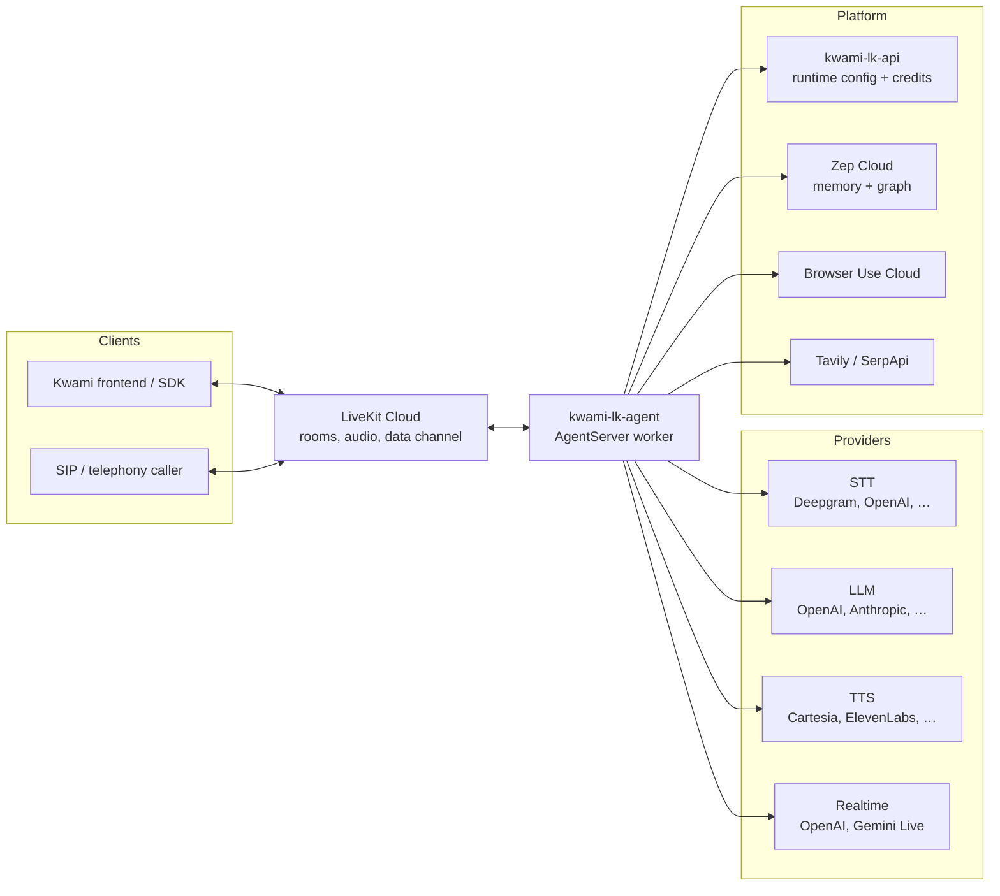
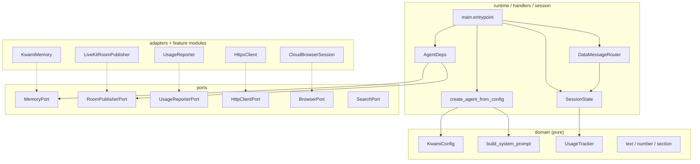
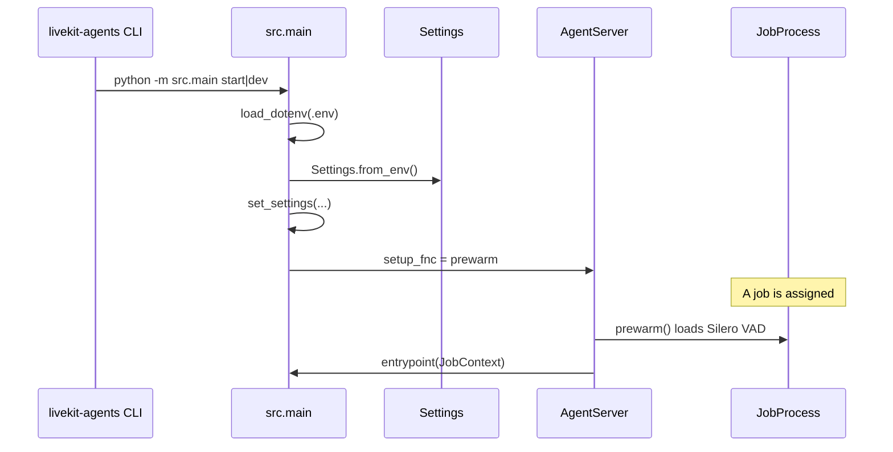
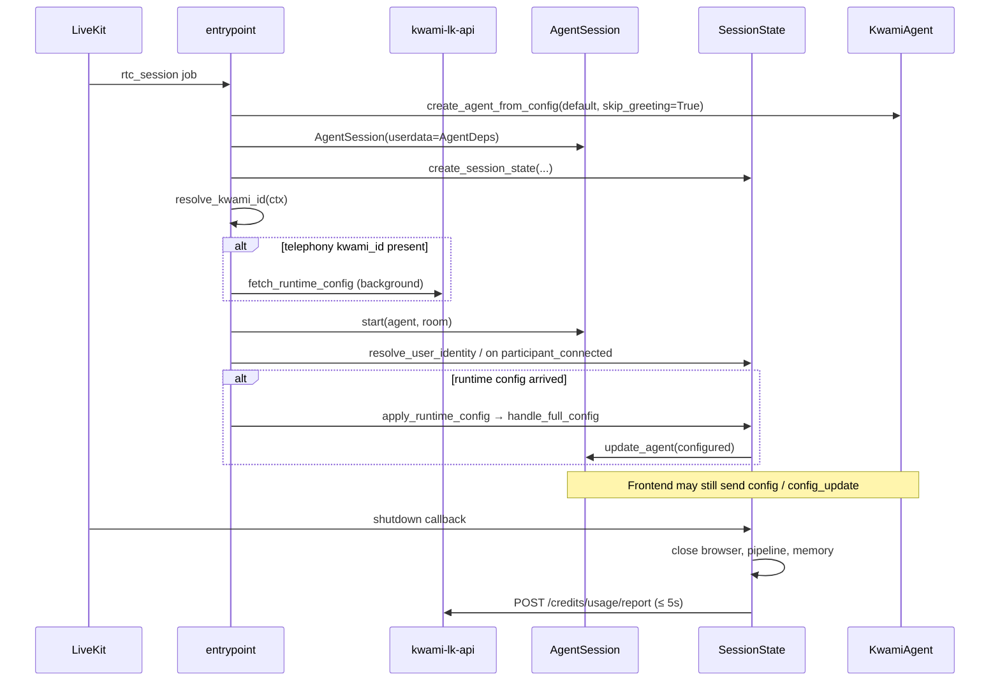
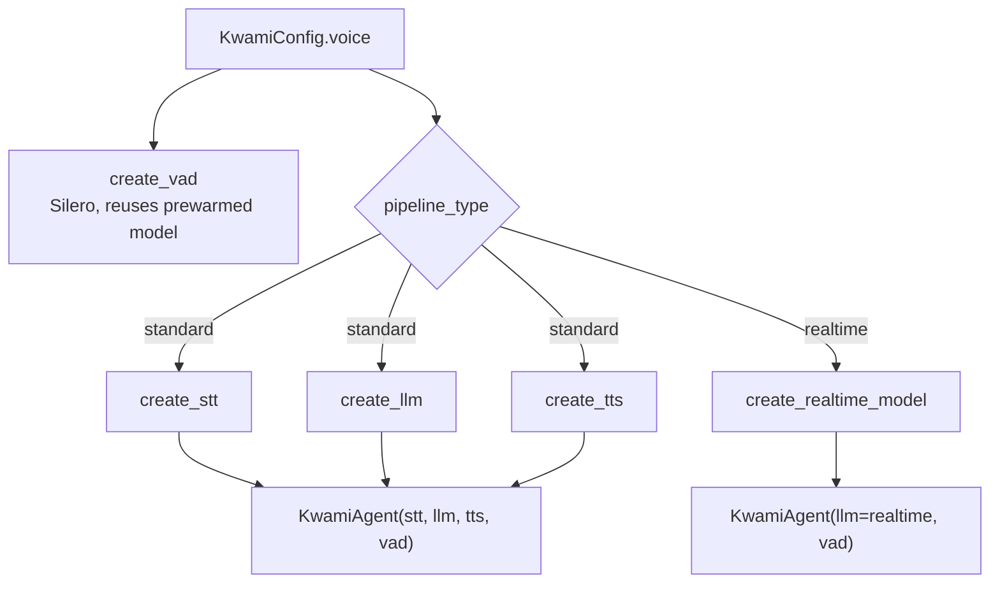
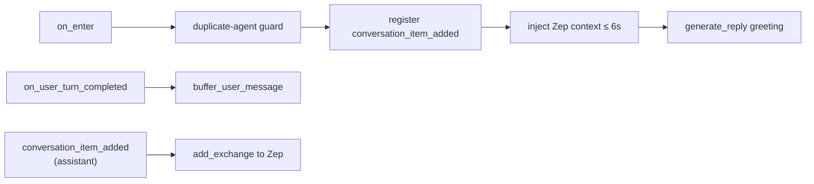

# Architecture

Kwami LiveKit Agent is a single LiveKit worker. One process registers one
entrypoint (`kwami-agent`). Different personas are configuration, not separate
agents: the frontend (or the telephony bootstrap) sends a `config` message and
the running agent is rebuilt in place.



A LiveKit worker can host many concurrent jobs. Each job is one room, one
`AgentSession`, one `SessionState`, and one current `KwamiAgent`.

## Design principles

The recent layout is hexagonal on purpose. Earlier versions hid critical bugs
behind `MagicMock` and import-time `os.environ` reads. The current split exists
so those classes of failure are visible in CI.

| Layer | Responsibility | I/O? |
| --- | --- | --- |
| `domain/` | Config types, wire parsing, prompt assembly, usage maths | No |
| `ports/` | Structural `Protocol`s for every I/O boundary | Contract only |
| `adapters/` | LiveKit publisher, pooled HTTP client | Yes |
| `runtime/` | Job lifecycle, data-channel dispatch, pipeline construction | Orchestration |
| `factories/` | STT / LLM / TTS / VAD / realtime construction | Provider SDKs |
| `handlers/` | `config`, `config_update`, `tool_result` | Yes |
| `memory/`, `browser/`, `usage/`, `tools/` | Feature modules behind ports | Yes |

Dependency arrows point inward. Adapters do not import ports as base classes;
they satisfy them structurally. `runtime.pipeline` is **not** re-exported from
`runtime/__init__.py` because `agent.py` imports `runtime.container` — that
re-export would create an import cycle.



## Process startup



Credentials are resolved once, after `load_dotenv`, into a frozen `Settings`
object. Downstream code takes settings as a value. Tests construct
`Settings(...)` directly and never depend on the developer's shell.

## Job lifecycle

The entrypoint starts a **placeholder** agent so the room comes up immediately.
The real persona arrives either from the frontend (`config` data message) or,
for telephony, from `GET /internal/kwamis/{id}/runtime` on kwami-lk-api.

The telephony fetch is started **before** `session.start()` so the HTTP round
trip overlaps room setup. A failure never takes the session down: the
placeholder agent is a worse experience than the configured one, but it is
still a working call.



Identity for billing can arrive after the agent: a human may join the room
late. `resolve_identity_on_join` adopts the first non-agent participant so
usage is not silently dropped.

## Voice pipelines

`runtime/pipeline.py` decides the entire inference graph from `KwamiConfig.voice`.



| Pipeline | When | Components |
| --- | --- | --- |
| `standard` (default) | Separate STT, LLM, TTS providers | Deepgram/OpenAI/… → GPT/Claude/… → Cartesia/ElevenLabs/… |
| `realtime` | Ultra-low latency | OpenAI GPT-4o Realtime or Gemini Live, plus VAD |

Missing optional provider packages (`livekit-plugins-anthropic`,
`livekit-plugins-google`, …) log a warning and fall back to OpenAI rather than
failing the session.

VAD settings on the config are honoured. The prewarmed Silero model is reused
unless the session asks for different turn-taking.

## Agent reconfiguration

`SessionState.update_agent` is the only place an agent is swapped. Config
messages are serialized through `state.config_lock` so two close-together
updates cannot race on `session.update_agent`.

On swap the session:

1. Closes the old agent's STT / LLM / TTS connections.
2. Closes the old Zep client **only** if the new agent does not share it.
3. Hands the live cloud browser to the new agent (otherwise it keeps billing).
4. Transfers unresolved client-tool futures so in-flight UI calls do not time out.
5. Re-attaches `usage_tracker` and `room`.

Soul and memory-knob updates can happen without a swap
(`update_soul`, `update_memory`). TTS/STT provider changes and every LLM change
recreate the agent.

## Agent hooks

`KwamiAgent` extends `livekit.agents.Agent` plus `AgentToolsMixin`.



Important constraints, all learned the hard way:

- `on_enter` takes **no arguments**. A previous `room` parameter was always
  `None`, which disabled duplicate detection and wiped `self.room`.
- Memory injection is hard-capped at `Timeouts.MEMORY_CONTEXT` (6s). A slow Zep
  must never delay the first utterance.
- Assistant turns are persisted from `conversation_item_added`, not from a
  fictional `on_agent_turn_completed` hook the framework never dispatched.
- Background tasks are retained on the agent / session. A bare
  `asyncio.create_task` can be garbage-collected mid-flight.

## Tools

Built-in tools live on `AgentToolsMixin`. Client-side tools are registered from
the frontend and executed over the data channel (see [Protocol](./protocol.md)).

| Group | Tools |
| --- | --- |
| Identity / voice | `get_kwami_info`, `get_current_time`, `change_voice`, `change_speaking_speed`, `change_language`, `get_current_voice_settings` |
| Memory | `remember_fact`, `recall_memories`, `get_memory_status` |
| Search | `web_search`, `product_search`, `dismiss_search_result` |
| Browser | `navigate_to`, `go_back_in_browser`, `go_forward_in_browser`, `close_navigation`, `click_in_navigation`, `type_in_navigation`, `press_key_in_navigation`, `scroll_navigation`, `run_js_in_navigation`, `read_navigation_page` |

Client tools such as `set_ui_control` / `list_ui_controls` are **not** defined
here. System-prompt guidance that names them is emitted only when the frontend
actually registered those tools.

Tools resolve the room through `AgentDeps` on `AgentSession.userdata`, which
the framework threads into every `RunContext`. There is no process-wide
`ContextVar` for the room.

## Source map

```
agent/src/
├── main.py                 # Worker, prewarm, entrypoint
├── agent.py                # KwamiAgent hooks and greeting
├── session.py              # SessionState: swaps, ownership, billing
├── settings.py             # Frozen env → Settings
├── runtime_bootstrap.py    # Telephony kwami_id + runtime config fetch
├── constants.py            # Provider / voice catalogues, timeouts
├── domain/                 # Pure: config, parsing, prompt, usage, errors
├── ports/                  # Protocols: memory, search, browser, publisher, billing, HTTP
├── adapters/               # LiveKit publisher, pooled httpx client
├── runtime/                # dispatch, lifecycle, pipeline, AgentDeps
├── factories/              # STT, LLM, TTS, VAD, realtime
├── handlers/               # config, config_update, tool_result
├── memory/                 # Zep manager, context, search, ontology
├── tools/                  # Built-in mixin + ClientToolManager
├── browser/                # Browser Use Cloud, CDP, URL safety
├── usage/                  # Credits API reporter
└── utils/                  # Logging, room, provider, validation
```
