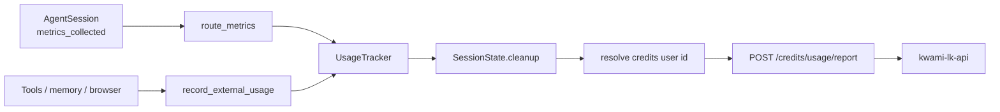

# Billing and usage

The agent does not price anything itself. It **accumulates** provider usage
during the job and **reports** a summary to kwami-lk-api when the session
ends. The API converts that summary into credits.



## What is tracked

`UsageTracker` (`domain/usage.py`) is thread-safe and keyed by model id.

| `model_type` | Unit | Source |
| --- | --- | --- |
| `llm` | tokens (prompt, completion, cached) | `llm_metrics` |
| `stt` | audio minutes | `stt_metrics` |
| `tts` | characters | `tts_metrics` |
| `realtime` | audio minutes **and** text tokens | `realtime_model_metrics` |
| `tool` | request count / units | Tavily, SerpApi, Microlink, … |
| `memory` | request count | Zep retrieval that returned content |
| `browser` (via tool/external) | wall-clock minutes | `CloudBrowserSession` on every release |

An entry is billable if **any** of these is non-zero: `total_units`,
`request_count`, text/prompt/completion tokens. Filtering on `total_units`
alone dropped two real cases: per-request tools and text-only realtime turns.

Cloud browsers are the most expensive resource the agent can hold. Minutes
are recorded on idle timeout, failed CDP connect, user close, and session
cleanup — not only on a clean shutdown.

## Identity

Credits are keyed on the **Supabase user id**, not the per-Kwami memory id.

| Session field | Where it comes from |
| --- | --- |
| `user_identity` | First human participant, or `kwamiId` from `config` |
| Late join | `resolve_identity_on_join` on `participant_connected` |
| Shutdown fallback | `current_agent.kwami_config.kwami_id` |
| Credits `user_id` | If identity looks like `kwami_<auth>_<rest>`, use `<auth>` |

A session that ends with no identity and no `kwami_id` logs a warning and
skips the report.

## Report payload

```
POST {KWAMI_API_URL}/credits/usage/report
Content-Type: application/json
X-API-Key: {KWAMI_API_KEY}
```

```json
{
  "user_id": "supabase-user-id",
  "session_id": "livekit-room-name",
  "usage": {
    "openai/gpt-4o-mini": {
      "model_type": "llm",
      "total_units": 1842,
      "prompt_tokens": 1200,
      "completion_tokens": 642
    }
  }
}
```

`session_id` is the LiveKit room name.

## Shutdown budget

LiveKit grants shutdown callbacks roughly **10 seconds**. Cleanup order is
deliberate:

1. Await in-flight pipeline / memory close tasks
2. Close the cloud browser (stops per-minute billing, persists the profile)
3. Close the current agent's STT / LLM / TTS and Zep client
4. Report usage last, bounded to **5 seconds** (`USAGE_REPORT_TIMEOUT_SECONDS`)
   with an inner HTTP timeout of **4 seconds**

Reporting first used to mean a slow credits API consumed the whole budget and
the worker was killed before the browser closed — leaking spend. A timeout or
non-200 response is logged as an error; the session does not retry (the
process is going away).

```mermaid
sequenceDiagram
    participant LK as LiveKit worker
    participant State as SessionState
    participant Browser as CloudBrowserSession
    participant API as credits API

    LK->>State: shutdown callback (~10s)
    State->>State: gather pipeline/memory cleanup
    State->>Browser: close() + record minutes
    State->>State: close current pipeline + Zep
    State->>API: POST usage (wait ≤ 5s)
    alt 200
        API-->>State: charged + new_balance
    else timeout / error / false
        State->>State: log; revenue for this session lost
    end
```

## Local development

If `KWAMI_API_KEY` is unset the reporter returns `False` and logs that usage
will not be billed. That is expected on a laptop with only provider keys.

Point `KWAMI_API_URL` at a reachable host. Inside Docker, `localhost` is the
container, not your machine — use `host.docker.internal`, a LAN IP, or a
tunnel.
