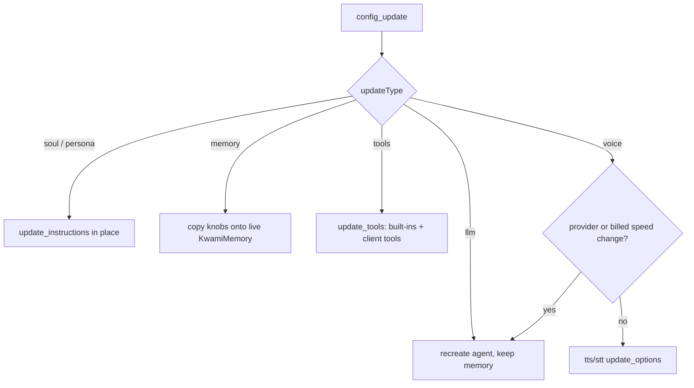

# Configuration

Two layers:

1. **Process settings** — secrets and URLs from the environment, frozen at start.
2. **Session config** — soul, voice pipeline, memory knobs, and client tools,
   sent over the data channel (or fetched for telephony).

## Environment

Copy `.env.sample` to `.env`. Every variable the agent reads is listed there
and on `Settings`.

### Required for a local voice session

| Variable | Purpose |
| --- | --- |
| `LIVEKIT_URL` | LiveKit Cloud WebSocket URL |
| `LIVEKIT_API_KEY` / `LIVEKIT_API_SECRET` | Worker credentials |
| `OPENAI_API_KEY` | Default LLM (and fallback for missing plugins) |
| `DEEPGRAM_API_KEY` | Default STT |
| `CARTESIA_API_KEY` | Common TTS (OpenAI TTS also works) |

### Required for billing and telephony

| Variable | Purpose |
| --- | --- |
| `KWAMI_API_URL` | kwami-lk-api base URL (default `http://localhost:8080`) |
| `KWAMI_API_KEY` | Shared secret (`X-Kwami-API-Key` / `X-API-Key`) |
| `KWAMI_API_TIMEOUT` | Runtime-config fetch timeout (default 30s, floor 1s) |

### Optional features

| Variable | Feature |
| --- | --- |
| `ZEP_API_KEY` | Persistent memory |
| `TAVILY_API_KEY` | `web_search` |
| `SERPAPI_KEY` | `product_search` (Google Shopping cards) |
| `BROWSER_USE_API_KEY` | Cloud browsing |
| `KWAMI_ALLOW_BROWSER_JS` | Allow `run_js_in_navigation` (default off) |
| `MISTRAL_API_KEY` | Mistral via OpenAI-compatible endpoint |
| `ELEVEN_API_KEY` | ElevenLabs TTS (STT can use LiveKit Inference without it) |
| `ASSEMBLYAI_API_KEY` | AssemblyAI STT |
| `GOOGLE_API_KEY` / `GOOGLE_APPLICATION_CREDENTIALS` | Gemini / Google STT-TTS |
| `ANTHROPIC_API_KEY` | Claude (needs `livekit-plugins-anthropic`) |
| `GROQ_API_KEY` | Groq |
| `DEEPSEEK_API_KEY` | DeepSeek |
| `CEREBRAS_API_KEY` | Cerebras |
| `XAI_API_KEY` | xAI Grok |

Optional extras in `pyproject.toml`: `anthropic`, `google`, `elevenlabs`.
When a plugin is missing the factory logs a warning and falls back to OpenAI.

`Settings.describe()` logs which keys are `set` or `MISSING` — never the values.

## Session config (`KwamiConfig`)

Built from a `config` message in `handlers/config_handler.py`. Wire parsing
lives in `domain/parsing.py` so a `null` section or a string-typed number
cannot crash the handler.

### Identity

| Field | Notes |
| --- | --- |
| `kwamiId` | Memory user id and billing fallback |
| `kwamiName` | Display / greeting name |

### Soul

| Field | Default | Notes |
| --- | --- | --- |
| `name` | `Kwami` | Spoken identity |
| `personality` | friendly companion | Free text |
| `systemPrompt` | empty | Appended into the assembled prompt |
| `traits` | `[]` | Labels |
| `conversationStyle` | `friendly` | |
| `responseLength` | `medium` | `short` / `medium` / `long` |
| `emotionalTone` | `warm` | See `EMOTIONAL_TONE_GUIDE` |
| `emotionalTraits` | `{}` | Sliders; only large magnitudes become directives |

`persona` is a deprecated alias for `soul`.

### Voice

`pipelineType`: `standard` (default) or `realtime`.

**Standard**

| Block | Providers (defaults) |
| --- | --- |
| `stt` | deepgram / openai / assemblyai / google / elevenlabs / cartesia — default `deepgram` + `nova-2` |
| `llm` | openai / google / anthropic / groq / deepseek / mistral / cerebras / ollama — default `openai` + `gpt-4o-mini` |
| `tts` | openai / elevenlabs / cartesia / deepgram / google / rime — default `openai` + `tts-1` + `nova` |

Model strings may include a provider prefix (`openai/gpt-4o-mini`); it is
stripped before the factory runs.

`llm.temperature` and `llm.maxTokens` accept `0`. TTS `speed` is `0.5`–`2.0`.

**Realtime**

| Field | Default |
| --- | --- |
| `realtime.provider` | `openai` |
| `realtime.model` | `gpt-4o-realtime-preview` |
| `realtime.voice` | `alloy` |

Also accepted as flat `realtimeProvider` / `realtime_provider` keys.

**VAD** (Silero): `threshold`, `min_speech_duration`, `min_silence_duration`.
The prewarmed model is reused unless turn-taking settings differ.

### Memory knobs

| Field | Default |
| --- | --- |
| `enabled` | `true` when `ZEP_API_KEY` is set |
| `maxContextMessages` | `10` (live updates clamp 1–50) |
| `includeFacts` | `true` |
| `minFactRelevance` | `0.5` (live updates clamp 0–1) |

### Client tools

A list of OpenAI-style function definitions (`name`, `description`,
`parameters`), optionally wrapped in `{ "function": { … } }`. Invalid entries
are skipped.

## Presets

`get_preset_config(name)` returns a `KwamiVoiceConfig` for local experiments:

| Preset | Intent |
| --- | --- |
| `fast` | Groq + Deepgram nova-3 |
| `balanced` | GPT-4o-mini + Deepgram nova-2 (default) |
| `quality` | GPT-4o + ElevenLabs turbo |
| `multilingual` | Deepgram `multi` + GPT-4o |
| `realtime` | OpenAI Realtime |

The frontend does not have to use these; they are server-side helpers.

## Live updates

See [Protocol](./protocol.md) for `config_update`. Summary:

Switching TTS provider clears the previous provider's model and voice so a
Cartesia `sonic-3` id is not sent to OpenAI.
