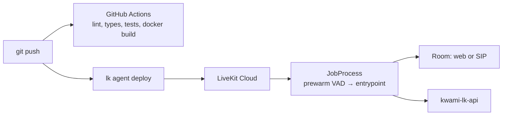

# Deployment

The agent ships as a Docker image. There are two supported places to run it:

| Target | Path | Use it when |
| --- | --- | --- |
| **LiveKit Cloud** (default) | `agent/` + `lk agent deploy` | You want LiveKit to own scaling, placement and restarts. |
| **Cloudflare Workers + Containers** | `infra/` + `make deploy-cf` | You want the agent next to the rest of your Cloudflare estate, or a Worker-fronted health surface. |

Both run the same image and the same `src.main start` entrypoint. One worker,
one agent name: `kwami-agent` (`livekit.toml` + `@server.rtc_session`).



## First-time create

```bash
cd agent
lk agent create .     # or: make create
```

This registers the agent with your LiveKit Cloud project. `livekit.toml`
stores the project subdomain and agent id.

## Deploy

```bash
make deploy           # cd agent && lk agent deploy
```

LiveKit Cloud builds from `agent/Dockerfile` (or uses the image it builds on
their side from the same context). CI already `docker build`s that context on
every PR so a broken image is caught before you deploy.

## Image

`agent/Dockerfile`:

- Base: `ghcr.io/astral-sh/uv:python3.13-bookworm-slim`
- `uv sync --locked` from `pyproject.toml` + `uv.lock`
- Non-root `appuser` (UID 10001)
- `python -m src.main download-files` at build time (VAD / plugin assets)
- CMD: `uv run python -m src.main start`

Local Python is 3.11; production is 3.13. Both must stay green in CI.

## Secrets on LiveKit Cloud

Configure the same variables as `.env.sample` in the Cloud agent secrets UI
(or whatever `lk` currently documents). Minimum production set:

- `LIVEKIT_URL`, `LIVEKIT_API_KEY`, `LIVEKIT_API_SECRET` (usually injected)
- `OPENAI_API_KEY`, `DEEPGRAM_API_KEY`, plus any other providers you advertise
- `KWAMI_API_URL` — **not** `localhost`. Use the public API origin.
- `KWAMI_API_KEY` — must match the API
- Optional: `ZEP_API_KEY`, `TAVILY_API_KEY`, `SERPAPI_KEY`, `BROWSER_USE_API_KEY`

Leave `KWAMI_ALLOW_BROWSER_JS` unset unless you accept the
[prompt-injection risk](./security.md).

## Telephony

SIP participants do not send a frontend `config`. The worker:

1. Reads `kwami_id` from job metadata, participant metadata, or attributes
2. Starts `GET /internal/kwamis/{id}/runtime` **before** `session.start()`
3. Applies the JSON as a full config after the room is up

If the fetch fails, the placeholder agent stays on the call. Set
`KWAMI_API_TIMEOUT` as low as you can tolerate; callers hear the default
persona until it returns.

## Scaling and lifecycle

LiveKit Cloud owns concurrency, placement, and process restart. This repo
does not include Kubernetes manifests. Each job:

- Prewarms Silero VAD on the process
- Registers `state.cleanup` as a shutdown callback (~10s budget)
- Reports usage last so billing cannot starve browser teardown

See [Billing](./billing.md) and [Architecture](./architecture.md).

## Cloudflare Workers + Containers

`infra/` runs the same agent image inside a Cloudflare Container, fronted by a
Worker. A LiveKit worker must stay registered with LiveKit Cloud, so the
container is kept alive deliberately rather than being allowed to sleep.

```bash
make install          # also installs infra/ deps via pnpm
make deploy-cf         # production   (wrangler deploy --env "")
make deploy-cf-staging # staging      (wrangler deploy --env staging)
```

### How it stays up

- `sleepAfter = "24h"` and `onActivityExpired()` calls `renewActivityTimeout()`
  instead of the default stop, so an idle-but-registered worker is not reaped.
- A cron trigger (`*/2 * * * *`) calls `ensureRunning()` as a keep-alive.
- `ensureRunning()` is wrapped in `blockConcurrencyWhile`, so simultaneous
  requests cannot race two container starts.

### Worker routes

| Route | Method | Meaning |
| --- | --- | --- |
| `/health`, `/status` | GET | Starts the container if needed, then proxies the container's own `/health`. |
| `/start` | POST | Starts the container and returns its state. |
| `/`, `/ready` | GET | Service, environment and container state. |

`/health` returns `503` with `status: "degraded"` when the Worker is reachable
but the container is not — the Worker being up is still useful information, so
it is not reported as a flat `error`. **Cloudflare Containers requires the
Workers Paid plan**; on a free account the health route returns `degraded` with
a `hint` naming that as the cause.

### Configuration and secrets

Non-secret values live in `wrangler.jsonc` under `vars` (`ENVIRONMENT`,
`LIVEKIT_URL`, `KWAMI_API_URL`, `KWAMI_API_TIMEOUT`, `KWAMI_ALLOW_BROWSER_JS`).
Provider credentials are Worker secrets, forwarded into the container by
`containerEnvFromWorker()` in `infra/src/env.ts`:

```bash
cp infra/secrets.example.json infra/secrets.json   # gitignored
# edit, then:
cd infra && pnpm secrets:bulk secrets.json
```

`infra/secrets.json` and `infra/.dev.vars` are gitignored and must stay that
way. `worker-configuration.d.ts` is generated by `pnpm types` from
`wrangler.jsonc` and is also gitignored — run it after editing bindings or vars,
or `tsc` will not see them.

### pnpm settings

pnpm 11 reads only auth and registry keys from `.npmrc`; everything else belongs
in `infra/pnpm-workspace.yaml`. Two settings there are load-bearing:

- `allowBuilds` for `esbuild` and `workerd` — both fetch prebuilt binaries in a
  postinstall script. Without approval the scripts are skipped and
  `wrangler dev` / `wrangler deploy` have no runtime.
- `minimumReleaseAgeExclude` for the Cloudflare toolchain — pnpm 11 defaults
  `minimumReleaseAge` to 24h, which would otherwise refuse a freshly published
  pinned `wrangler`.

`pnpm check` runs `wrangler deploy --dry-run`: it bundles the Worker, validates
every binding and migration, and builds the container image, all without
credentials. It is the closest thing to a real deploy and runs on every release
tag. `infra/container/Dockerfile` intentionally mirrors `agent/Dockerfile` —
keep the install and prewarm steps aligned when you change either.

## CI as a deploy gate

The `docker` job in `.github/workflows/test.yml` builds `context: agent`
without pushing. Treat a red Docker job as "do not deploy".

The `infra` job in the same workflow runs `wrangler types` then `tsc --noEmit`
over `infra/src/`, so a Worker that cannot compile is caught before
`make deploy-cf`.

Nightly e2e (`.github/workflows/e2e.yml`) is information, not a merge blocker.
A failure after merge to `main` means a provider or a live path broke.

## Versioning

`agent/pyproject.toml` carries the version; it is `1.0.0`. Releases are
documented in [CHANGELOG.md](../CHANGELOG.md) and follow
[Semantic Versioning](https://semver.org/).

To cut a release:

1. Move the `[Unreleased]` entries into a new `## [X.Y.Z] - YYYY-MM-DD`
   section and add the compare links at the bottom of the changelog.
2. Bump `version` in `agent/pyproject.toml`, then run `uv lock` so
   `agent/uv.lock` agrees (CI runs with `UV_FROZEN=1` and will fail if it
   does not).
3. Merge to `main`, then push the tag: `git tag -a vX.Y.Z -m 'vX.Y.Z' && git push origin vX.Y.Z`.

Pushing a `v*` tag triggers `.github/workflows/release.yml`, which re-runs the
full gate, verifies that the tag matches `agent/pyproject.toml`, and publishes a
GitHub Release using that version's changelog section as the body.
