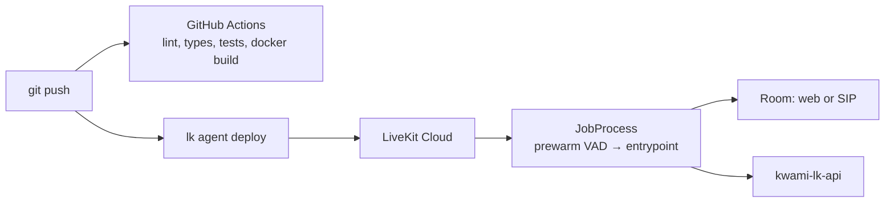

# Deployment

The agent ships as a Docker image that LiveKit Cloud builds and runs. One
worker, one agent name: `kwami-agent` (`livekit.toml` + `@server.rtc_session`).



## First-time create

```bash
cd agent
lk agent create .     # or: make create
```

This registers the agent with your LiveKit Cloud project. `livekit.toml`
stores the project subdomain and agent id.

## Deploy

```bash
make deploy           # cd agent && lk agent deploy
```

LiveKit Cloud builds from `agent/Dockerfile` (or uses the image it builds on
their side from the same context). CI already `docker build`s that context on
every PR so a broken image is caught before you deploy.

## Image

`agent/Dockerfile`:

- Base: `ghcr.io/astral-sh/uv:python3.13-bookworm-slim`
- `uv sync --locked` from `pyproject.toml` + `uv.lock`
- Non-root `appuser` (UID 10001)
- `python -m src.main download-files` at build time (VAD / plugin assets)
- CMD: `uv run python -m src.main start`

Local Python is 3.11; production is 3.13. Both must stay green in CI.

## Secrets on LiveKit Cloud

Configure the same variables as `.env.sample` in the Cloud agent secrets UI
(or whatever `lk` currently documents). Minimum production set:

- `LIVEKIT_URL`, `LIVEKIT_API_KEY`, `LIVEKIT_API_SECRET` (usually injected)
- `OPENAI_API_KEY`, `DEEPGRAM_API_KEY`, plus any other providers you advertise
- `KWAMI_API_URL` — **not** `localhost`. Use the public API origin.
- `KWAMI_API_KEY` — must match the API
- Optional: `ZEP_API_KEY`, `TAVILY_API_KEY`, `SERPAPI_KEY`, `BROWSER_USE_API_KEY`

Leave `KWAMI_ALLOW_BROWSER_JS` unset unless you accept the
[prompt-injection risk](./security.md).

## Telephony

SIP participants do not send a frontend `config`. The worker:

1. Reads `kwami_id` from job metadata, participant metadata, or attributes
2. Starts `GET /internal/kwamis/{id}/runtime` **before** `session.start()`
3. Applies the JSON as a full config after the room is up

If the fetch fails, the placeholder agent stays on the call. Set
`KWAMI_API_TIMEOUT` as low as you can tolerate; callers hear the default
persona until it returns.

## Scaling and lifecycle

LiveKit Cloud owns concurrency, placement, and process restart. This repo
does not include Kubernetes manifests. Each job:

- Prewarms Silero VAD on the process
- Registers `state.cleanup` as a shutdown callback (~10s budget)
- Reports usage last so billing cannot starve browser teardown

See [Billing](./billing.md) and [Architecture](./architecture.md).

## CI as a deploy gate

The `docker` job in `.github/workflows/test.yml` builds `context: agent`
without pushing. Treat a red Docker job as "do not deploy".

Nightly e2e (`.github/workflows/e2e.yml`) is information, not a merge blocker.
A failure after merge to `main` means a provider or a live path broke.

## Versioning

`agent/pyproject.toml` version is `0.1.0`. Releases are documented in
[CHANGELOG.md](../CHANGELOG.md). There is no automated release workflow yet.
