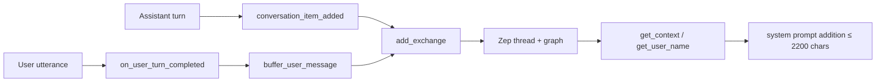
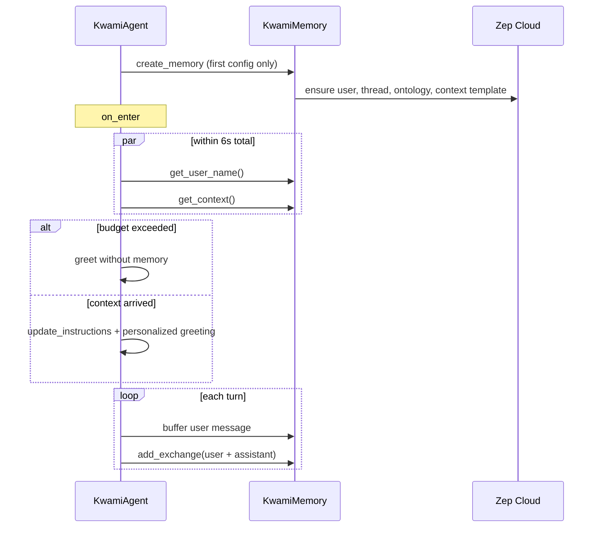
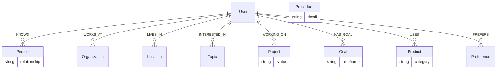

# Persistent memory

Each Kwami can keep independent, long-lived memory on
[Zep Cloud](https://www.getzep.com/). Memory is an enhancement, not a
requirement: if `ZEP_API_KEY` is unset, or Zep is slow, the agent still
greets and talks.

Enable it by setting `ZEP_API_KEY`. `Settings.memory_enabled` is true exactly
when that key is present.

## What is stored

| Store | Contents |
| --- | --- |
| Thread | User and assistant turns, batched as one `add_messages` call |
| Knowledge graph | Facts extracted from user turns, with temporal validity |
| Custom ontology | Person, Project, Product, Goal, Procedure plus constrained edges |

Assistant text is sent with the user turn so Zep has context for extraction,
but `ignore_roles=["assistant"]` keeps the assistant from becoming a graph
entity.

## Identity

- Zep `user_id` = `kwami_id` from the config message (or telephony bootstrap)
- Typical shape: `kwami_<supabaseUserId>_<kwamiId>`
- Thread id is minted per conversation (`session_{user}_{uuid4}`) unless the
  config supplies `session_id`

Reusing the same `user_id` across config updates is required for recall. A
previous bug created a new `AsyncZep` and a new thread on every `config`
message, so facts were written and never found.

`handle_full_config` therefore **reuses** the live `KwamiMemory` when the new
config targets the same Zep user, and only copies retrieval knobs
(`max_context_messages`, `include_facts`, `min_fact_relevance`). A different
user id creates a new client; the old one is closed by `SessionState`.

## Session timeline

Budgets (see `constants.Timeouts`):

| Budget | Value | Why |
| --- | --- | --- |
| `ZEP_REQUEST` | 8s | Zep's SDK default is 60s per call |
| `MEMORY_CONTEXT` | 6s | `get_user_name` + `get_context` together, before greeting |
| Greeting fallback | immediate | Product is a voice; silence is worse than a generic hello |

`get_user_name` and `get_context` run concurrently. The greeting reuses the
cached context so it does not pay a second round trip.

## Ontology

Custom types extend Zep defaults (User, Assistant, Preference, Location,
Event, Object, Topic, Organization, Document). Edges carry explicit
source **and** target constraints so the graph does not grow User-centric
orphans.

`configure_ontology` is a project-level replace. That is one reason the client
must not be rebuilt on every config message.

## Agent tools

| Tool | Purpose |
| --- | --- |
| `remember_fact` | Write an explicit fact into the graph |
| `recall_memories` | Search threads / graph for a topic |
| `get_memory_status` | Initialized?, user id, cached name |

Search-derived facts are written in the background so a Zep hiccup does not
block the spoken answer.

## Billing

Zep retrieval is metered only when it returned content. Empty or failed
lookups do not increment the usage tracker. See [Billing](./billing.md).

## Failure modes

| Failure | Behaviour |
| --- | --- |
| No `ZEP_API_KEY` | Memory stays disabled; no tools talk to Zep |
| Init / ontology error | Logged; session continues without memory |
| Context timeout | Greeting without personalization |
| Write error mid-session | Logged; conversation continues |
| Config targets a new user | New client; old client closed |
| Config targets same user | Live client reused |
