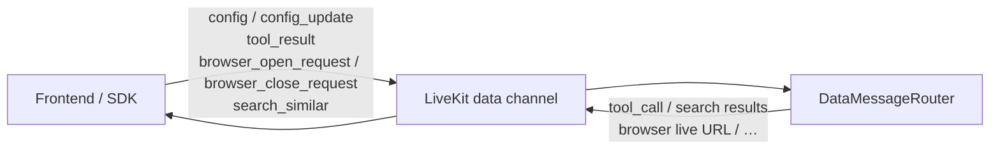
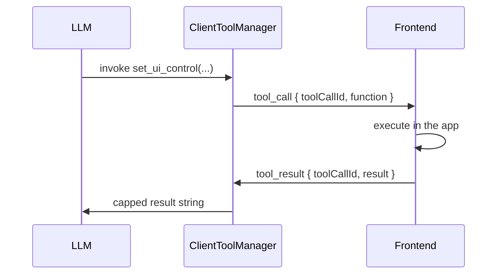

# Data-channel protocol

The frontend and the agent share a LiveKit room. Audio is the voice path.
Control, configuration, tool calls, and UI payloads travel on the **data
channel** as UTF-8 JSON objects with a `type` field.

Malformed packets are discarded. `decode_data_message` never raises: bad UTF-8,
bad JSON, and non-object payloads return `None` so a hostile or buggy client
cannot take down the handler for the rest of the session.



Packet size is capped at **14 000 bytes** (`MAX_DATA_PACKET_BYTES`) so the
publisher stays under LiveKit's hard limit after the SDK envelope. Oversized
search payloads are trimmed in stages (prose first, images last).

## Inbound messages (frontend → agent)

Routed by `DataMessageRouter` in `runtime/dispatch.py`. Config work is spawned
through `SessionState.spawn` and serialized through `run_serialized`.

### `config`

Full identity and pipeline. Replaces the placeholder agent. See
[Configuration](./configuration.md) for the field catalogue.

```json
{
  "type": "config",
  "kwamiId": "kwami_<authUserId>_<kwamiId>",
  "kwamiName": "Ada",
  "soul": {
    "name": "Ada",
    "personality": "A calm research partner",
    "systemPrompt": "",
    "traits": ["curious"],
    "conversationStyle": "friendly",
    "responseLength": "medium",
    "emotionalTone": "warm",
    "emotionalTraits": { "empathy": 40, "curiosity": 25 }
  },
  "voice": {
    "type": "stt-llm-tts",
    "stt": { "provider": "deepgram", "model": "nova-2", "language": "en" },
    "llm": { "provider": "openai", "model": "gpt-4o-mini", "temperature": 0.7, "maxTokens": 1024 },
    "tts": { "provider": "openai", "model": "tts-1", "voice": "nova", "speed": 1.0 },
    "realtime": { "provider": "openai", "model": "gpt-4o-realtime-preview", "voice": "alloy" }
  },
  "memory": {
    "enabled": true,
    "maxContextMessages": 10,
    "includeFacts": true,
    "minFactRelevance": 0.5
  },
  "tools": [
    {
      "name": "set_ui_control",
      "description": "Change a workspace control",
      "parameters": { "type": "object", "properties": {} }
    }
  ]
}
```

`soul` still accepts the legacy key `persona`. CamelCase and snake_case keys
are both accepted (`systemPrompt` / `system_prompt`, …).

**Pipeline selection.** The field above is `voice.type`, which is what the
frontend SDK's `VoicePipelineConfig` actually carries. The agent reads
`type`, `pipelineType`, `pipeline_type` and `pipeline`, and accepts
`stt-llm-tts`, `standard`, `normal`, `classic` and `hybrid` for the STT → LLM →
TTS chain, or `realtime`, `real-time`, `speech-to-speech` and `s2s` for the
single speech-to-speech model. `hybrid` is in the SDK's union, has no
implementation here, and resolves to the standard pipeline with a warning.

This list is long because it was once short. The agent read only `pipelineType`
with the values `standard` / `realtime` — two spellings no client has ever
sent — so selecting the realtime pipeline in the app silently built an
STT+LLM+TTS agent, and every `realtime.*` setting below was parsed into fields
that branch never reads. An unrecognised value is rejected rather than treated
as `standard`, so a typo cannot quietly hand the user the wrong pipeline.

The first `config` of a session **does** greet. Later full configs skip the
greeting if one was already delivered.

### `config_update`

Partial update. `updateType` selects the branch.

| `updateType` | Effect |
| --- | --- |
| `voice` | Dispatches on the live pipeline. A pipeline switch rebuilds; on `realtime`, voice and temperature go over the open socket and provider/model rebuild; otherwise TTS/STT options, with a rebuild on a provider change or a speed change the provider cannot apply live |
| `pipeline` | Switches between `standard` and `realtime`, carrying any realtime fields in the same payload |
| `llm` | Recreates the agent. On the `realtime` pipeline this retargets the **realtime** model rather than building a standard pipeline underneath the session |
| `soul` / `persona` | Rebuilds instructions in place, preserves cached memory context |
| `memory` | Updates retrieval knobs on the live Zep client |
| `tools` | Re-registers client tools **alongside** the built-ins, capped (see below) |

Voice, speed and temperature on the realtime pipeline are pushed with
`RealtimeModel.update_options` rather than by rebuilding, because a rebuild
drops the socket and re-greets, which the user hears. Anything that decides
which object was constructed — provider, model, pipeline type — cannot be
pushed and rebuilds. Every rebuild carries the conversation, the live cloud
browser and any in-flight client-tool calls onto the new agent.

```json
{
  "type": "config_update",
  "updateType": "llm",
  "config": {
    "provider": "anthropic",
    "model": "claude-3-5-sonnet-latest",
    "temperature": 0.5
  }
}
```

For `tools`, `config` is the tool-definition list itself (not wrapped).

**Tool budget.** The model is sent the agent's built-ins plus every registered
client tool. OpenAI rejects a request carrying more than 128 tools outright, so
the combined list is trimmed to fit rather than sent over: built-ins are kept in
preference to client tools, and anything dropped is logged at `error` with its
name. A warning fires from 85% of the limit. Today the total is 93 — 40
built-in and 53 from `kwami-app`.

### `tool_result`

Completes a pending client-tool future. Results are capped at 4 000 characters
before they enter the LLM context.

```json
{
  "type": "tool_result",
  "toolCallId": "550e8400-e29b-41d4-a716-446655440000",
  "result": "ok",
  "error": null
}
```

If `error` is set, the model receives `Error from client: …`.

### `browser_open_request`

Opens a URL in the live browser panel — published when the user picks a search
result rather than asking for it out loud.

```json
{ "type": "browser_open_request", "url": "https://example.com/article" }
```

Routed through the same path as the agent's own `navigate_to`, so it inherits
both of that path's checks: the URL is validated (non-HTTP schemes, loopback,
private ranges, link-local metadata and DNS that resolves to any of them are
refused), and a browser is never started for a session with no `kwami_id`,
because a shared profile would carry one user's cookies to the next. The
frontend is not treated as a trusted source of URLs: the same envelope can
carry a link the model was reading on a page a moment earlier.

A refusal is logged at `warning`. There is no model turn to return a sentence
to on this path, so nothing else would make it visible.

### `browser_close_request`

User closed the live browser panel. Closes the session-owned
`CloudBrowserSession` so per-minute billing stops.

```json
{ "type": "browser_close_request" }
```

### `search_similar`

Runs `web_search` with `search_for_products=True` for
`similar to {title} buy`. The title is truncated to 80 characters.

```json
{ "type": "search_similar", "title": "Canvas tote bag" }
```

## Outbound messages (agent → frontend)

Published via `room.local_participant.publish_data` or
`LiveKitRoomPublisher`.

### `tool_call`

A client-side tool the LLM invoked. The frontend must reply with `tool_result`
using the same `toolCallId` within **30 seconds**.

```json
{
  "type": "tool_call",
  "toolCallId": "550e8400-e29b-41d4-a716-446655440000",
  "function": {
    "name": "set_ui_control",
    "arguments": "{\"domain\":\"theme\",\"control\":\"mode\",\"value\":\"dark\"}"
  }
}
```

`arguments` is a JSON **string**, not an object.



Pending futures survive agent swaps. `SessionState.update_agent` moves
unresolved calls onto the new `ClientToolManager`.

### Search and browser payloads

Built-in tools also publish structured events so the UI can render cards and a
live browser iframe. Typical `type` values include search-result batches and
browser session metadata (live view URL). Exact UI schemas live in the
TypeScript SDK; the agent treats them as JSON objects and trims them to fit
the 14 KB packet budget.

## Telephony bootstrap

Phone sessions have no frontend to send `config`. The worker resolves
`kwami_id` from job metadata, SIP participant metadata, or participant
attributes, then fetches:

```
GET {KWAMI_API_URL}/internal/kwamis/{kwami_id}/runtime
Header: X-Kwami-API-Key: {KWAMI_API_KEY}
```

The JSON body is the same shape as a `config` message and is applied through
`handle_full_config`.

## Metrics (not data channel)

Usage is not a data-channel message. The session listens for
`metrics_collected` on `AgentSession` and `route_metrics` dispatches:

| Metric `type` | Tracker method |
| --- | --- |
| `llm_metrics` | `on_llm_metrics` |
| `stt_metrics` | `on_stt_metrics` |
| `tts_metrics` | `on_tts_metrics` |
| `realtime_model_metrics` | `on_realtime_metrics` |

See [Billing](./billing.md).
