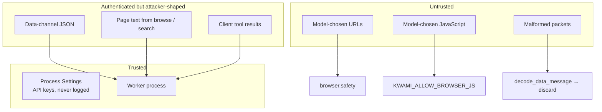
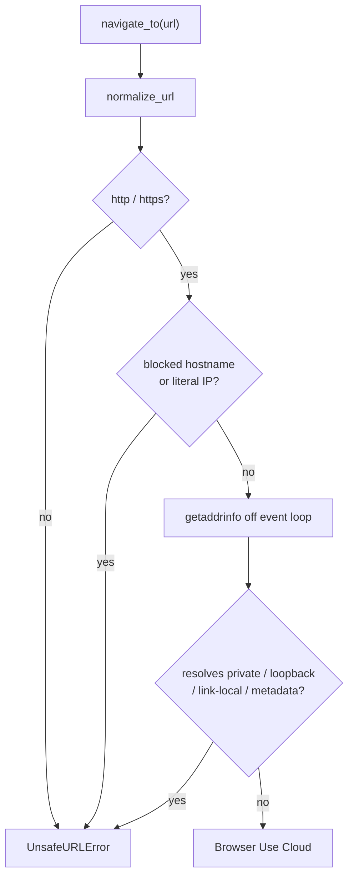

# Security

This document is the threat model and hardening notes for the agent. For how to
**report** a vulnerability, see the [security policy](../SECURITY.md).

The agent is a privileged process: it holds provider API keys, can drive a
cloud browser that keeps the user's cookies, writes long-term memory, and
reports usage that becomes a charge. A mistake here is either a data leak or
unbilled spend.

## Trust boundaries

| Boundary | What crosses it | Rule |
| --- | --- | --- |
| Data channel | Frontend JSON | Decode never raises; unknown types ignored; config serialized |
| Model → browser | URLs, click targets, JS | URL allow-list + DNS check; JS off by default |
| Page → model | Extracted text | Truncate to 4 000 chars; treat as hostile |
| Client tool → model | `tool_result` | Truncate to 4 000 chars |
| Memory → prompt | Zep context block | Truncate to 2 200 chars |
| Worker → credits API | Usage summary | Shared secret header; 5s shutdown budget |
| Worker → runtime API | Telephony config | Shared secret; failure stays on placeholder |
| Process → logs | Settings | Keys redacted to `set` / `MISSING` |

## Secrets

All credentials are resolved once in `Settings.from_env()` after `load_dotenv`.
The object is frozen. `Settings.describe()` is the only start-up dump, and it
never prints secret values.

Do **not**:

- Commit `.env` (gitignored; only `.env.sample` is tracked)
- Log request headers that carry `X-Kwami-API-Key` / `X-API-Key`
- Put keys in LiveKit room metadata or data-channel payloads
- Read `os.environ` in feature code — take `Settings` instead

Provider keys that LiveKit plugins read themselves (`OPENAI_API_KEY`, …) are
mirrored onto `Settings.provider_keys` so "is this provider usable?" does not
require touching the environment.

The Docker image runs as a non-root `appuser` (UID 10001).

## Data-channel input

`decode_data_message` treats every packet as attacker-shaped:

- Invalid UTF-8 / JSON / non-objects → `None`
- Non-string `type` → discarded
- Unknown `type` → ignored
- Config handlers catch and log; they do not kill the session

Numeric config fields go through `number` / `integer` so an explicit `0` is
honoured and a string does not raise. Nested sections tolerate `null`.

Client tool definitions are validated (`name` required, types checked) before
registration. Results and errors are capped before they reach the prompt, so a
buggy or hostile client cannot blow the context window — or the bill.

## Browser isolation

The cloud browser uses a **per-user** persistent profile. That is a feature
(logins survive) and a hazard (the model can act as the user). Two controls
are mandatory:

### Cloud browser vendors

Browserbase is the default (`KWAMI_BROWSER_PROVIDER`), with Browser Use
Cloud as the alternative. Both keep a per-user profile carrying real cookies
and logins, so everything below applies identically to either.

### URL validation (`browser/safety.py`)

`validate_url` / `validate_url_async` reject:

- Non-`http`/`https` schemes, including `javascript:` and `data:` (scheme
  detection is RFC 3986, not a `://` substring test)
- Hostnames `localhost`, `*.localhost`, `metadata`, `metadata.google.internal`
- Literal loopback, private, link-local (including `169.254.169.254`),
  reserved, multicast, and unspecified addresses
- Hostnames that **resolve** to any of the above (DNS checked off the event
  loop so a slow resolver is not audible dead air)

A browser is never started without a real `kwami_id`. A shared profile would
leak logins between users.

### JavaScript execution

`run_js_in_navigation` is gated by `KWAMI_ALLOW_BROWSER_JS` (default **off**).

`read_navigation_page` feeds untrusted page text to the model. A hostile page
can instruct the model to run JavaScript that reads `document.cookie` from the
logged-in profile. Leave the gate off unless you accept that risk.

Tool output from the browser is truncated to 4 000 characters.

## Prompt injection

Assume every retrieved string can contain instructions:

| Source | Cap | Notes |
| --- | --- | --- |
| Zep memory context | 2 200 chars in the system prompt | Greeting still runs if Zep is slow |
| Browser page text / JS result | 4 000 chars | JS disabled by default |
| Client `tool_result` | 4 000 chars | Both success and error paths |
| Search snippets | Publisher trim stages | Images kept longer than prose |
| `search_similar` title | 80 chars | Used only to build a query |

UI-control guidance that names `set_ui_control` / `list_ui_controls` is omitted
unless those client tools are registered, so the model is not invited to
hallucinate calls.

## Memory tenancy

Zep users are keyed on `kwami_id` (typically `kwami_<authUserId>_<kwamiId>`).
Each Kwami has its own graph. Do not reuse a memory client across different
`user_id`s. `handle_full_config` reuses the live client only when the new
config targets the **same** Zep user; otherwise a new client is created and
the old one is closed.

`add_exchange` passes `ignore_roles=["assistant"]` so the assistant does not
become a graph entity.

## Billing integrity

Usage that is not reported is free inference. The session:

- Adopts a late-joining human as `user_identity`
- Falls back to `kwami_id` from config on shutdown
- Extracts the Supabase user id from `kwami_<auth>_<id>` before POST
- Treats request-count-only and token-only realtime turns as billable
- Meters cloud-browser minutes on every release path (idle, error, close)
- Bounds the credits POST to 5 seconds inside a ~10s worker shutdown budget
- Logs loudly when the report times out or the API rejects it

The credits endpoint is authenticated with `X-API-Key`. The runtime-config
endpoint uses `X-Kwami-API-Key`. Both secrets must match kwami-lk-api.

## Duplicate agents

`on_enter` asks `should_disconnect_as_duplicate` and leaves the room if another
agent with the same role is already present. The previous `on_enter(room)`
signature meant this guard never ran.

## What this agent does not do

- No end-user authentication of its own — LiveKit tokens and kwami-lk-api own that
- No encryption beyond TLS to LiveKit, providers, and the API
- No multi-tenant isolation inside one process beyond per-job `SessionState`
- No guarantee that a determined model-plus-hostile-page pair cannot exfiltrate
  a logged-in browser profile if `KWAMI_ALLOW_BROWSER_JS=1`
- **No prevention of the first fetch after a redirect.** The landing URL *is*
  now checked: after navigating, `CloudBrowserSession._verify_landing_url` reads
  the page's actual URL and, if it is one we would have refused, leaves for
  `about:blank` and tells the model it cannot show what was there. That stops
  the content reaching the model. It does not stop the browser having fetched
  it — by the time the final URL is readable the request has happened. The same
  residue covers DNS rebinding: the name is resolved once here and again by the
  browser, and nothing guarantees the two answers match. The exposure is a
  request from the vendor's network, not ours

## Checklist for future changes

- New tool output that reaches the LLM must be size-capped
- New URLs the model can open must go through `validate_url_async`
- New env secrets belong on `Settings` (add them to `ENV_VAR_NAMES`), in
  `.env.sample`, in `infra/src/env.ts` and in `infra/secrets.example.json`.
  `tests/unit/test_worker_env_parity.py` fails if the Worker does not forward
  one; `tests/unit/test_settings_env_inventory.py` fails if the inventory
  drifts from what `from_env` reads. The Browserbase credentials reached only
  the first two of those four for an entire release.
- New background work must be retained via `SessionState.spawn` or an equivalent set
- New I/O should get a `ports/` protocol and a test fake, not a `MagicMock`
