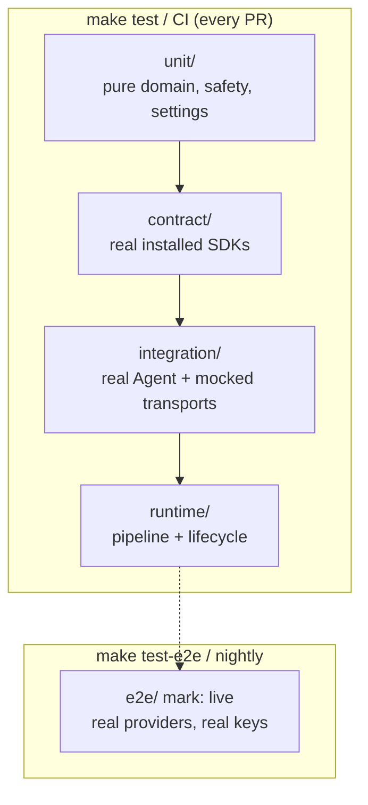

# Testing

Five layers under `agent/tests/`. The default pytest run is **offline, free,
and fast**. Live tests are opted in.



`pyproject.toml` sets `addopts = "-m 'not live'"`. `make test-e2e` passes
`-m live`. An empty live selection exits 5; the Makefile and the e2e workflow
treat that as a warning, not a failure.

## Layers

### `unit/`

No network, no LiveKit worker. Config parsing, prompt assembly, usage maths,
URL safety, Settings, dispatch, cloning, room helpers.

Good unit tests construct `Settings(...)` and `KwamiConfig(...)` directly.
They do not depend on what the developer exported.

### `contract/`

This codebase's assumptions checked against the **real** installed packages:

- Hooks we override exist with the signatures we use (`on_enter` takes no room)
- Every advertised provider constructs
- Every Zep method we call is a real method

**Never stub `livekit` or `zep_cloud`.** An earlier `conftest.py` replaced both
with `MagicMock`, which agreed with every wrong assumption: a bad `on_enter`
signature, a hook the framework never dispatches, and five nonexistent Zep
methods passed for months.

### `integration/`

A real `livekit.agents.Agent` with mocked transports. Covers config wire
parsing, tool publishing, client-tool results, browser-tool safety, memory
reuse across config updates.

### `runtime/`

Pipeline construction (including the realtime branch) and lifecycle helpers
(`apply_runtime_config`, `resolve_identity_on_join`) without standing up a
worker.

### `e2e/` (`live`)

Conversation, memory, and reconfiguration against real providers. Spends
money. Runs on a nightly cron, `workflow_dispatch`, and push to `main` — not
as a pull-request gate.

## Coverage

```bash
make test-cov
```

`fail_under` in `pyproject.toml` is a ratchet. It only moves up, and it is
raised by adding tests -- never by lowering it to meet the tree. Branch
coverage is on.

CI uploads `coverage.xml` per Python version (3.11 and 3.13).

### What may be excluded

Categorical exclusions live in `exclude_also` in `pyproject.toml`, so they can
be audited in one place: `if TYPE_CHECKING:` and `@overload`.

A `# pragma: no cover` at a call site is allowed for two cases only, and only
with the reason written on the same line:

1. **An optional-extra import guard.** `livekit-plugins-google` and friends are
   extras, so a locked environment always resolves the import the same way and
   a test that forces the other branch is testing its own monkeypatch.
2. **The process entry point** (`if __name__ == "__main__":`).

Anything else that cannot be covered is a design problem, not an exclusion.

### Pinning a call into a plugin that is not installed

Where an optional plugin's constructor cannot be reached but the call into it
is still worth protecting, use a **strict stand-in** -- explicit keyword
signatures, no `MagicMock` -- and say in the docstring that what is verified is
our call shape and not the SDK's. Rename or drop a kwarg and the test fails,
which is the regression this buys. See `tests/unit/test_stt_factory.py` for the
pattern.

### Running coverage while someone else is

`agent/.coverage` is a single SQLite file. Two processes writing it at once
produce nonsense -- `no such table: arc`, and totals like `0.00%`. For an
ad-hoc run, point `COVERAGE_FILE` somewhere of your own:

```bash
COVERAGE_FILE=/tmp/mine.coverage make test-cov
```

## Writing a test

1. Prefer a **fake** that implements a port over `MagicMock`.
2. If you call a LiveKit or Zep API, import the real package.
3. Put provider-hitting tests under `e2e/` and mark them `@pytest.mark.live`.
4. Reset Settings between tests that change env (`set_settings(None)` / fixture).
5. Do not add sleeps to hide races; serialize through the same locks production uses.

## What CI runs

| Workflow | When | Jobs |
| --- | --- | --- |
| `.github/workflows/test.yml` | PR and push to `dev` / `stg` / `main` | Ruff, mypy, pytest+coverage on 3.11 and 3.13, Docker build |
| `.github/workflows/e2e.yml` | Nightly 03:00 UTC, `main`, manual | Live suite with GitHub `e2e` environment secrets |

Offline CI sets `UV_FROZEN=1` and does not inject provider keys, so a test
that accidentally authenticates fails loudly.
